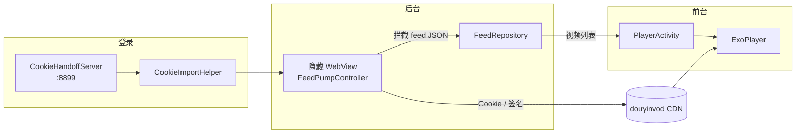
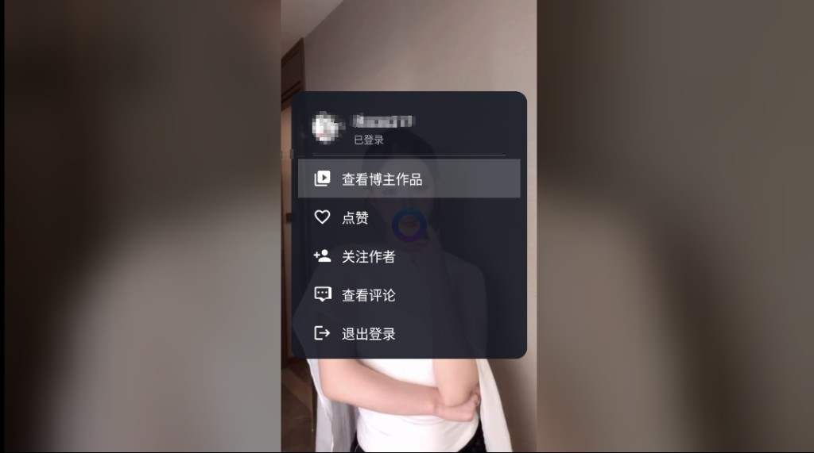
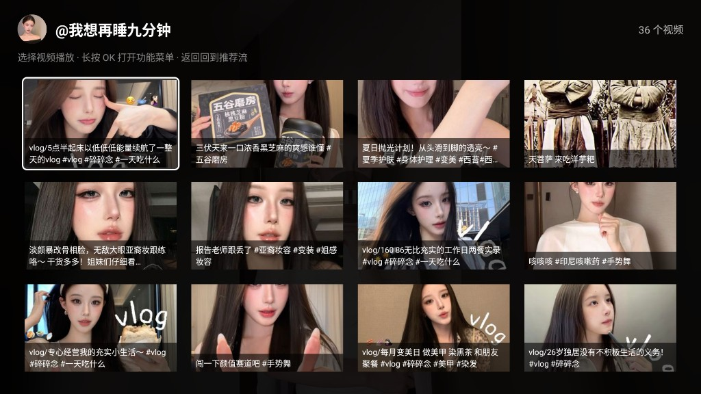

# TV DY

[](LICENSE)
[](app/src/main/AndroidManifest.xml)
[](app/build.gradle.kts)
[](app/build.gradle.kts)

在 Android TV、电视盒子、投影仪上用遥控器刷抖音。

TV DY 采用 **原生 ExoPlayer 播放 + 隐藏 WebView 数据泵** 的混合架构：后台 WebView 加载 douyin.com 并拦截页面自带的 feed 接口响应，提取带有效签名的视频流地址；前台用 ExoPlayer 全屏播放，上下切换带 TikTok 式滑动动画，专为遥控器操作优化。

> 本项目为第三方开源客户端，与抖音官方无任何关联。仅供学习交流，请遵守相关法律法规与平台服务条款。

---

## 功能特性

- **原生播放** — Media3 ExoPlayer 直链播放，预加载后续 5 条视频，弱网环境下缓冲策略针对 TV 优化
- **Feed 数据泵** — 隐藏 WebView 被动捕获页面 fetch/XHR 的 feed JSON，不自行伪造签名请求，分页由页面滚动触发
- **遥控器导航** — 上下切视频、左右快进/快退、OK 键播放/暂停与功能菜单
- **Cookie 登录** — 手机/电脑扫码提交浏览器 Cookie，无需在电视上输入长字符串
- **创作者作品** — 登录后可浏览当前视频作者的全部作品并点播
- **已看过滤** — 记录账号历史与本机播放过的视频，feed 缓冲中自动跳过
- **TV 适配** — 支持 Leanback Launcher；TV 设备启动超时自动延长；横屏全屏沉浸

---

## 架构概览



| 模块 | 说明 |
|------|------|
| `FeedPumpController` | 隐藏 WebView，Hook fetch/XHR，捕获 feed 与分页数据 |
| `FeedRepository` | 视频缓冲队列，供播放器消费 |
| `PlayerActivity` | 唯一界面：播放、遥控器、菜单、登录 |
| `CookieHandoffServer` | 局域网 HTTP 服务，接收手机/PC 提交的 Cookie |
| `WatchedAwemeStore` | 按 session 持久化已看视频 ID |
| `CreatorVideoRepository` | 创作者主页作品列表 |

---

## 截图

| 启动加载 | 视频播放 |
|:---:|:---:|
|  |  |
| Feed 数据泵等待首条视频 | 标题、作者、进度条与互动数据 |

| 功能菜单 | 创作者作品 |
|:---:|:---:|
|  |  |
| 长按 OK 打开，登录后可查看博主作品 | 4 列网格浏览作者全部视频 |

---

## 环境要求

| 项目 | 版本 |
|------|------|
| Android Studio | Ladybug 或更高（AGP 8.12+） |
| JDK | 11 |
| compileSdk / targetSdk | 35 |
| minSdk | 21（Android 5.0+） |
| 设备 | Android TV、电视盒子，或带遥控器的 Android 设备 |

---

## 构建与安装

```bash
# 克隆仓库
git clone https://github.com/Jie009/TikTokTV.git
cd TikTokTV

# 构建 Debug APK
./gradlew assembleDebug

# 安装到已连接设备（需开启 USB 调试或 adb 网络连接）
adb install -r app/build/outputs/apk/debug/app-debug.apk
```

Windows 下可使用 `gradlew.bat assembleDebug`。

Release 构建：

```bash
./gradlew assembleRelease
```

---

## 遥控器操作

### 播放界面

| 按键 | 功能 |
|------|------|
| **上 / 下** | 上一条 / 下一条视频 |
| **OK 短按** | 显示信息栏；播放中再次短按暂停；暂停时短按恢复 |
| **OK 长按** | 打开功能菜单 |
| **左 / 右** | 后退 / 快进 5 秒（按住连续 seek） |
| **返回** | 先关闭信息栏 / 菜单 / 登录页；连按两次退出应用 |
| **播放/暂停键** | 切换播放状态 |

播放时信息栏（标题、作者、进度、点赞/收藏/评论数）会在 3 秒后自动隐藏。

### 功能菜单

长按 OK 进入菜单，**上 / 下** 选择，**OK** 确认，**返回** 关闭。

| 菜单项 | 状态 | 说明 |
|--------|------|------|
| 登录账号 | ✅ | Cookie 扫码登录 |
| 创作者作品 | ✅ | 浏览当前作者的全部视频 |
| 退出登录 | ✅ | 清除 Cookie 并恢复匿名 feed |

---

## 登录说明

抖音网页登录带有滑块验证码，TV 端无法直接完成登录，因此采用 **Cookie 导入** 方式：

1. 在电脑或手机浏览器登录 [douyin.com](https://www.douyin.com)
2. 打开开发者工具 → Network，复制任意请求的完整 `Cookie` 请求头
3. 在 TV 上 **长按 OK** → 选择 **登录账号**
4. 用手机扫描屏幕上的二维码（需与 TV 在同一局域网）
5. 在打开的网页表单中粘贴 Cookie 并提交
6. App 会向抖音服务器验证 session 有效性，成功后自动刷新 feed

### ADB 脚本（开发调试）

项目提供了 PowerShell 脚本，可通过 adb reverse 直接向本机 `8899` 端口提交 Cookie：

```powershell
# 前提：App 已打开登录界面并等待提交
.\scripts\inject-cookie.ps1 -CookieFile .cursor\tmp_cookie.txt
```

---

## 项目结构

```
app/src/main/java/mulin/tvdy/
├── player/          # PlayerActivity、ExoPlayer、滑动切换、创作者网格
├── pump/            # FeedPumpController、XHR 拦截、分页状态
├── data/            # FeedRepository、FeedVideo、已看记录
├── auth/            # Cookie 导入、登录验证、QR 码、局域网 Handoff
├── api/             # Native feed 客户端与签名服务
├── feed/            # Feed 控制器抽象
├── DouyinConstants.java   # UA、Referer、请求头
├── DeviceUtils.java       # TV 设备检测
└── TvdyApplication.java   # WebView 预热
```

---

## 技术栈

- [AndroidX Media3 ExoPlayer](https://developer.android.com/media/media3) — 视频播放
- [AndroidX WebKit](https://developer.android.com/develop/ui/views/layout/webapps) — WebView 兼容层
- [ZXing](https://github.com/zxing/zxing) — 登录二维码生成
- [Lottie](https://airbnb.io/lottie/) — 启动与加载动画

---

## 常见问题

**启动后长时间停留在加载页？**  
Feed 数据泵需要 WebView 加载 douyin.com 并等待页面发起 feed 请求。TV 设备网络较慢时最长等待约 2 分钟，超时后可短按 OK 重试。登录状态下会优先打开「精选」页以加快 feed 触发。

**视频无法播放？**  
CDN 直链需要正确的 Referer 与 Cookie。请确认已登录且 Cookie 未过期；匿名模式下部分视频可能受限。

**登录二维码无法生成？**  
需确保 TV 已连接 Wi-Fi 或以太网，且手机与 TV 在同一局域网。

**点赞 / 评论 / 关注？**  
不做这些操作。播放页只展示抖音返回的点赞/收藏/评论数统计。

---

## 免责声明

- 本软件按「现状」提供，不提供任何明示或暗示的保证
- 使用本软件产生的任何后果由使用者自行承担
- 请尊重内容创作者版权，勿用于商业用途或大规模爬取
- 「抖音」及相关商标归字节跳动所有

---

## 开源协议

[MIT License](LICENSE) — Copyright (c) 2025 yemulin

---

## 致谢

- 参考了 [ygtec-org/douyin-tv](https://github.com/ygtec-org/douyin-tv) 等社区项目的 TV 适配思路
